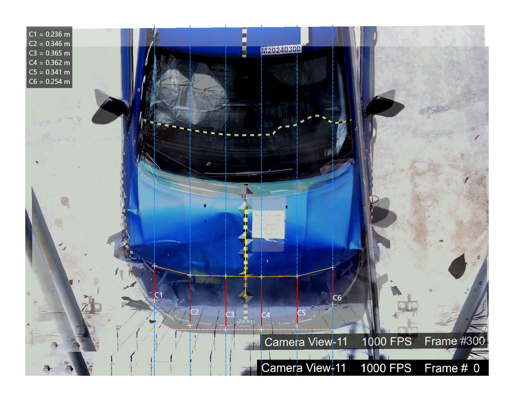

# CRASH3Vision

**Semi-assisted image-based vehicle deformation measurement and CRASH3/EES estimation**

CRASH3Vision is experimental research software developed to support the extraction of vehicle structural deformation parameters from digital images and their application to deformation-energy and Energy Equivalent Speed (EES) estimation using CRASH3-derived methods.

The project combines **forensic engineering, digital image analysis, vehicle collision reconstruction and reproducible research software**.

> **Current status:** v1.0.0 — public research release  
> **Research stage:** preliminary experimental validation / proof-of-concept  
> **License:** PolyForm Noncommercial License 1.0.0

<p align="center">
  
</p>

---

## Overview

Vehicle collision reconstruction frequently relies on measurements of permanent structural deformation. In conventional workflows, these measurements are commonly obtained manually in the field, which may introduce operational limitations related to accessibility, measurement repeatability, documentation and later verification.

CRASH3Vision implements a semi-assisted workflow based on digital images, combining:

- geometric image calibration;
- alignment of reference and damaged vehicle images;
- measurement of total damaged width (**W**);
- measurement of six structural crush depths (**C1–C6**);
- optional structural offset representation;
- management of vehicle stiffness coefficients (**A/B**);
- CRASH3-derived deformation-energy calculation;
- Energy Equivalent Speed (**EES**) estimation;
- measurement and calculation traceability;
- technical report generation.

The software was developed specifically to operationalize and experimentally evaluate this methodology.

---

## Scientific motivation

Traditional deformation measurements can be affected by operator interpretation, limited access to damaged structures, time constraints and lack of standardized geometric documentation.

Image-based workflows provide an opportunity to preserve the original visual evidence while allowing measurements to be reviewed and reproduced later.

The research behind CRASH3Vision investigates whether a low-cost, semi-assisted image-based approach can provide useful deformation parameters while improving documentation, traceability and operational efficiency.

---

## Experimental evaluation

The methodology was preliminarily evaluated in two complementary phases.

The two phases were designed to address different questions:

- **Phase 1** evaluated the error associated with obtaining deformation measurements from images against controlled NHTSA reference results.
- **Phase 2** evaluated the workflow under real-world field conditions, using conventional manual measurements as the reference.

### Phase 1 — Controlled crash-test data

Official NHTSA crash-test imagery was used as a technical reference.

The Phase 1 sample was constrained by the availability of NHTSA tests with overhead or near-nadir camera views suitable for image-based deformation measurements. Five compatible vehicle tests were identified.

To increase measurement replication within this limited sample, three forensic examiners performed three independent measurements per vehicle.

- **5 vehicle models**
- **3 forensic examiners**
- **3 independent measurements per examiner/model**
- **N = 45 measurements**
- **Global MAPE for EES: 3.52%**

The purpose of this phase was to estimate the error associated with replacing conventional deformation measurements with measurements extracted from images, using the EES values reported in the corresponding NHTSA crash-test documentation as the controlled reference.

### Phase 2 — Real-world UAV imagery

Images of damaged vehicles acquired using unmanned aerial vehicles (UAVs) were analyzed and compared with conventional field measurements.

The field sample was limited to three suitable damaged vehicles available during the study period. This phase was therefore designed as a preliminary proof-of-concept of the method under operational conditions rather than as a large-scale validation study.

- **3 real vehicles**
- **3 forensic examiners**
- **3 independent measurements per examiner/model**
- **N = 27 measurements**
- **Global MAPE for EES: 4.60%**

The purpose of this phase was to evaluate the workflow in a realistic forensic context, comparing measurements obtained from images with measurements performed manually in the field.

Overall, the experimental dataset contained **72 independent measurements**.

The image-based workflow also reduced the average time required to obtain deformation parameters from **19.3 min to 11.1 min per vehicle**, corresponding to an observed reduction of approximately **40.9%** under the tested conditions.

| Experimental result | Value |
|---|---:|
| Phase 1 global MAPE | **3.52%** |
| Phase 2 global MAPE | **4.60%** |
| Total independent measurements | **72** |
| Average measurement-time reduction | **40.9%** |

These results should be interpreted within the experimental scope and limitations described below.

---

## Method overview

The workflow implemented in CRASH3Vision follows the general sequence:

1. Load reference and/or damaged vehicle image.
2. Align images when a reference image is available.
3. Calibrate image scale.
4. Define the damaged width (**W**).
5. Divide W into five equal intervals.
6. Measure the six crush depths (**C1–C6**).
7. Define or retrieve structural stiffness coefficients (**A/B**).
8. Calculate deformation energy.
9. Estimate EES.
10. Save measurements, project data and technical outputs.

Six crush ordinates define five intervals across the damaged width.

The methodology can also use a structural offset associated with the bumper reinforcement or crossmember when appropriate.

---

## Features

- Single-image and dual-image workflows
- Reference/deformed image alignment
- Semi-transparent overlay with nudge, rotation and scale controls
- Geometric calibration using known metric references
- Semi-assisted measurement of **W** and **C1–C6**
- Optional bumper crossmember offset line for structural reference
- CRASH3 extended energy calculation in SI units
- EES calculation
- Crush profile visualization
- Structural stiffness coefficients from:
  - manual entry;
  - generic demonstrative vehicle classes;
  - NHTSA crash-test report workflow;
  - internal NHTSA A/B library;
  - import/export of A/B records in JSON
- Bilingual interface (Portuguese / English)
- Technical report export with audit trail
- Project save/load
- PNG canvas export

---

## Methodology and equations

The EES is estimated from structural deformation energy using a CRASH3-derived formulation.

```text
E = (W/5) × [ (A/2) × Σkᵢ·Cᵢ + (B/6) × Σkᵢ·Cᵢ² + 5G ] × (1 + tan²α)
```

Where:

- `C1..C6` — structural crush depths (m)
- `A`, `B` — vehicle structural stiffness coefficients (N/m and N/m²)
- `W` — damaged width (m)
- `G = A²/(2B)` — residual energy term
- `α` — impact angle (degrees)

EES is then obtained from:

```text
EES = √(2E / m)
```

Stiffness coefficients A and B can be derived from NHTSA crash-test data using the methodology implemented by the software and documented in the associated research.

---

## Installation

### Requirements

- Python 3.10+
- PySide6

Clone the repository:

```bash
git clone https://github.com/brunopneves/crash3vision.git
cd crash3vision
```

Create and activate a virtual environment:

```bash
python -m venv .venv
```

Windows:

```powershell
.\.venv\Scripts\Activate.ps1
```

Install dependencies:

```bash
python -m pip install -r requirements.txt
```

Run:

```bash
python -m app.main
```

---

## Project structure

```text
crash3vision/
├── app/
│   ├── main.py
│   ├── version.py
│   ├── i18n.py
│   ├── core/
│   ├── ui/
│   │   ├── canvas/
│   │   ├── overlay/
│   │   ├── tools/
│   │   ├── controllers/
│   │   └── widgets/
│   ├── report/
│   ├── data/
│   │   ├── nhtsa_ab_library.json
│   │   └── stiffness_library.json
│   └── assets/
│       ├── welcome.png
│       └── crash3_icon.ico
├── CHANGELOG.md
├── CITATION.cff
├── LICENSE
├── THIRD_PARTY_NOTICES
├── requirements.txt
└── README.md
```

---

## Demonstration coefficients and assets

`app/data/stiffness_library.json` contains **illustrative coefficients only**, intended to demonstrate the software workflow, including its generic classes and vehicle entries.

These values are not an official technical reference and must not be used in forensic applications without independent verification against an appropriate source.

The library may be updated in future releases with documented and referenced values.

This notice concerns the generic library; NHTSA-derived records are documented separately in [`THIRD_PARTY_NOTICES`](THIRD_PARTY_NOTICES).

`app/assets/welcome.png` and `app/assets/crash3_icon.ico` are original assets generated by the author for CRASH3Vision and are redistributed with the project.

---

## User data

The application stores user data, including the personal A/B library, at:

- **Windows:** `%USERPROFILE%\.crash3vision\data\`
- **Linux/macOS:** `~/.crash3vision/data/`

On first launch, the bundled library is copied to this location. Users can add their own records through the NHTSA A/B dialog, and those records persist independently of software updates.

---

## Current scope and limitations

CRASH3Vision should currently be considered **experimental research software**.

The validation described in the associated study is preliminary and focused primarily on frontal vehicle deformation.

Known limitations include:

- limited experimental sample size;
- manual interpretation of structural landmarks;
- dependence on image resolution and contrast;
- influence of image perspective;
- dependence on appropriate stiffness coefficients;
- possible uncertainty when internal structural elements are partially hidden;
- validation currently concentrated on frontal impacts.

In Phase 1, the sample size was constrained by the limited availability of suitable NHTSA tests with overhead or near-nadir imagery. In Phase 2, the sample was limited by the availability of suitable real-world damaged vehicles during the study period.

For these reasons, the current results should be interpreted as a **preliminary proof-of-concept**, not as definitive validation for all vehicle types, impact configurations or operational conditions.

CRASH3Vision should therefore be used as an **experimental support and research tool**, not as an autonomous substitute for technical reconstruction analysis.

---

## Research roadmap

Completed:

- [x] Semi-assisted image-based CRASH3 workflow
- [x] Controlled NHTSA experimental evaluation
- [x] Real-world UAV evaluation
- [x] Multi-examiner measurements
- [x] Save/load and traceability workflow
- [x] Public research software release v1.0.0

Research directions:

- [ ] Larger multi-vehicle validation dataset
- [ ] Expanded uncertainty analysis
- [ ] Perspective and geometric-distortion correction
- [ ] Validation for lateral and rear impacts
- [ ] Comparison with photogrammetry, LiDAR and 3D scanning
- [ ] Automated structural landmark detection
- [ ] AI-assisted deformation measurement
- [ ] Expanded documented stiffness-coefficient database

---

## Associated research

The methodology and experimental validation are described in:

**B. P. Neves, J. G. Silva Neto, R. de O. Mapele**  
*Metodologia semiassistida por imagem para mensuração de deformações veiculares e estimativa da EES pelo método CRASH3.*  
XXVIII Congresso Nacional de Criminalística — CNC 2026, Brazil.

The study combines:

- controlled NHTSA crash-test imagery;
- real-world UAV imagery;
- multiple forensic examiners;
- repeated measurements;
- comparison with technical reference values;
- analysis of measurement error, variability and operational time.

CRASH3Vision is the software implementation developed to operationalize and evaluate the proposed methodology.

---

## Citation

If CRASH3Vision contributes to scientific work, technical evaluation or academic research, please cite the software.

GitHub supports the repository's [`CITATION.cff`](CITATION.cff) file through the **Cite this repository** function.

Suggested software citation:

> Neves, B. P. (2026). **CRASH3Vision (Version 1.0.0)**. Research software for semi-assisted image-based vehicle deformation measurement and CRASH3/EES estimation.

The associated scientific study should also be cited when the methodology itself is used.

---

## References

1. Strother, C.E.; Woolley, R.L.; James, M.B.; Warner, C.Y. *Crush Energy in Accident Reconstruction*. SAE Technical Paper 860371 (1986).
2. Vangi, D. *Simplified method for evaluating energy loss in vehicle collisions*. Accident Analysis & Prevention, 41, 633–641 (2009).
3. NHTSA. *Vehicle Crash Test Database*. U.S. Department of Transportation.
4. Silva Neto, J.G.; Andrade, T.L.; Silva, L.G.C. *Utilização de drone de baixo custo em local de acidente de trânsito: um estudo de caso*. Revista Brasileira de Criminalística, 14: 567–572 (2025).
5. Toresan Jr., W.; Didyk, M. *Reconstrução de colisões veiculares*. 2. ed. Instituto de Ciências Forenses, 2026.

---

## License

CRASH3Vision is **source-available for non-commercial use** under the [PolyForm Noncommercial License 1.0.0](LICENSE).

The license applies to the authors' own CRASH3Vision code. Third-party dependencies retain their respective licenses and rights; see [`THIRD_PARTY_NOTICES`](THIRD_PARTY_NOTICES).

Commercial use outside the permitted purposes requires separate authorization or a separate license from the copyright holder.

This is not an OSI-approved open-source license.

---

## Assets and data

The CRASH3Vision icon and welcome image are original project assets generated by the author for this software and are distributed with the project.

NHTSA-related coefficient records included in the software retain their corresponding technical references where available.

The generic stiffness library is included only for demonstration of the application workflow and should not be treated as an authoritative technical database.

No forensic case photographs or private case data are included in the public repository.

---

## Author

**Bruno P. Neves**  
Forensic engineer / criminal forensic examiner  
Brazil  
Contact: bpn.bruno@gmail.com ; brunopessoa@pci.rn.gov.br

Research collaborators:

- J. G. Silva Neto
- R. de O. Mapele

---

## Acknowledgements

The associated research acknowledges the support of the **Polícia Rodoviária Federal (PRF)** and **Polícia Científica do Rio Grande do Norte (PCI-RN)**.

The opinions, hypotheses, conclusions and recommendations expressed in the research remain the responsibility of the authors.

---

## Disclaimer

CRASH3Vision is experimental scientific software.

Results produced by the application depend on input data, image quality, measurement interpretation, vehicle parameters and stiffness coefficients.

Outputs should be independently reviewed by a qualified professional before being used in technical or forensic conclusions.
